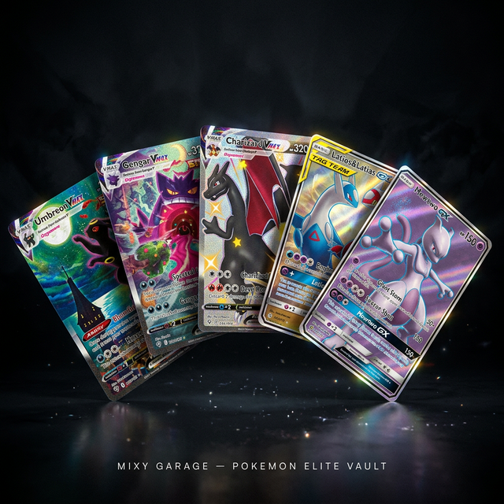
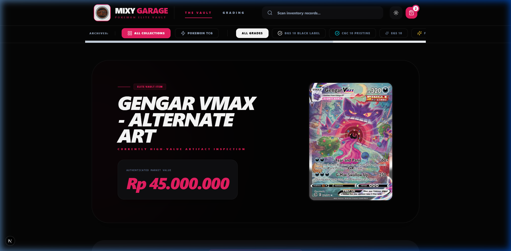
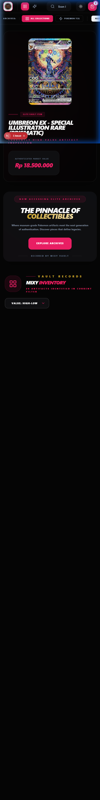
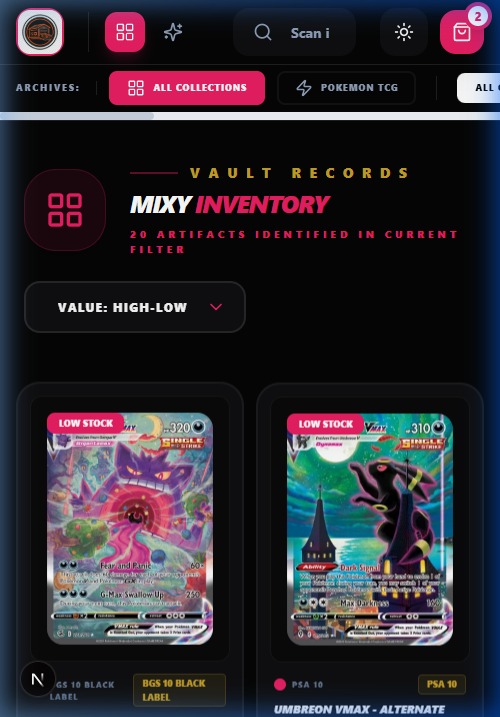

<div align="center">
  
  <br/><br/>

  <h1>🃏 Mixy Garage — Pokemon Elite Vault</h1>
  <p><strong>A premium collectibles storefront built for serious card collectors.</strong><br/>Browse, inspect, and buy high-grade Pokemon TCG cards with real market valuations.</p>

  <p>
    
    
    
    
  </p>
</div>

---

## What's inside

Mixy Garage is a dark-mode Pokemon card vault that doubles as a storefront. It's not your typical e-commerce template — it started as a personal project to track and display a private collection, and grew into a full-fledged frontend with 3D card effects, grading filters, a cart system, and a mobile layout that doesn't break.

The goal was always to make it feel like a premium product, not another cookie-cutter shop page.

---

## Features

**🎴 3D Card Showcase**
The hero section rotates through featured high-value cards. Hover over the card to pause the rotation and control the 3D tilt with your mouse. Rarity-based holo shimmer effects are applied depending on the card's market value.

**🗂️ The Vault — Product Grid**
All inventory is displayed in a filterable grid sorted by value. Cards carry condition labels (PSA 10, BGS Black Label, EGS 10, etc.) and real-world Rupiah pricing pulled from a curated local dataset.

**🔍 Item Inspection Modal**
Click any card to open a full-detail overlay — high-res image, market valuation, condition, and set metadata. Built with Framer Motion so the entrance/exit feels snappy but not cheap.

**🏷️ Grading Section**
Separate view for Pokemon grading services. Filter by grading company across the archived collection.

**🌙 Dark / Light Mode**
Seamlessly switches between modes. The design was built dark-first, but the light version holds its own.

**📱 Fully Responsive**
Works on phones, tablets, and widescreen monitors. The layout doesn't reflow awkwardly — cards stack into 2 columns on mobile, navigation collapses into icon buttons, and the hero section scales gracefully.

---

## Screenshots

### Desktop — 3D Card Showcase
The featured item rotates every 3 seconds. Hover to pause and tilt the card in 3D space.



---

### Mobile — Hero & Navigation
The header adapts to smaller screens. Navigation collapses to icon buttons, search stays accessible.



---

### Mobile — Product Grid
Cards are displayed 2-per-row with condition badges, reduced text sizing, and optimized padding.



---

## Getting started

### Prerequisites
- **Node.js** 18+
- **npm** or **yarn**

### Install

```bash
git clone https://github.com/yourusername/mixy-garage.git
cd mixy-garage
npm install
```

### Run locally

```bash
npm run dev
```

Open [http://localhost:3000](http://localhost:3000) in your browser.

---

## Inventory & pricing

All product data lives in two flat JSON files in the `public/` directory:

| File | Purpose |
|---|---|
| `public/prices.json` | Product list: name, price, category, qty, condition |
| `public/item-images.json` | Maps product names to local image paths |

Card images are stored in `public/items/`. To add new cards, drop the image file into `public/items/` and add the corresponding entries to both JSON files.

### Adding cards via the scraper

A helper script (`scrape.js`) is included for batch-importing cards from the Pokemon TCG GitHub data dump:

```bash
node scrape.js
```

This will download 50 high-resolution card images from an open dataset, auto-assign prices based on rarity, and update both JSON files.

> The script targets the `sv3pt5` (Scarlet & Violet 151) set by default. Change the `API_URL` in `scrape.js` to target a different set.

---

## Project structure

```
mixy-garage/
├── app/
│   ├── page.tsx         # Main app — all components live here
│   ├── layout.tsx       # Root layout & theme setup
│   └── globals.css      # Global styles + custom vault design tokens
├── public/
│   ├── items/           # Card images
│   ├── prices.json      # Inventory data
│   └── item-images.json # Image path mapping
└── scrape.js            # Card scraper utility
```

---

## User guide

### Browsing the Vault

1. Click **The Vault** in the navigation.
2. Filter by grade using the quick-filter bar (`ALL GRADES`, `PSA 10`, `BGS 10 BLACK LABEL`, etc.).
3. Sort cards by value using the **Value: High-Low** dropdown.
4. Use the **Search** bar to find a specific card by name instantly.

### Inspecting a card

Click any card image in the grid to open the **Item Inspection** overlay.
- View the high-res card art
- Check graded condition and authenticated market price
- Add to cart from the overlay

### 3D Showcase

- The featured card rotates automatically every 3 seconds between your highest-value items.
- **Hover** the card to pause the rotation.
- **Move your mouse** across the card to control the 3D tilt and the holo shimmer effect.
- Move your mouse away to resume automatic rotation.

### Cart

Click the cart icon (top right) at any time to review your selections before checkout.

---

## Tech stack

| Tech | Role |
|---|---|
| Next.js 15 (App Router) | Core framework |
| TypeScript | Type safety |
| Tailwind CSS | Styling |
| Framer Motion | Animations & transitions |
| next-themes | Dark/light mode |
| lucide-react | Icons |

---

## License

Personal project. Not affiliated with Nintendo, The Pokemon Company, or any associated grading services.

All card images belong to their respective rights holders and are used for display purposes only.